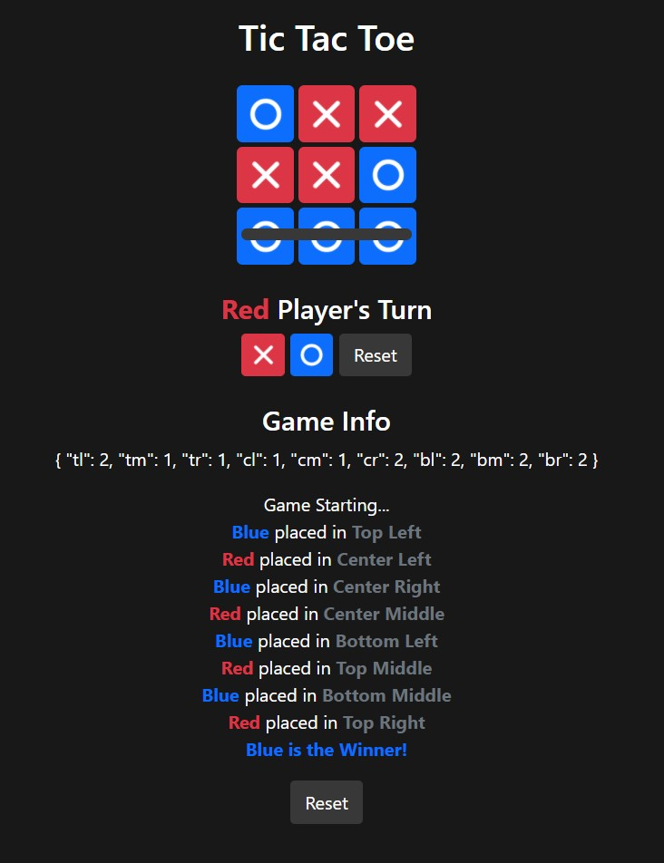
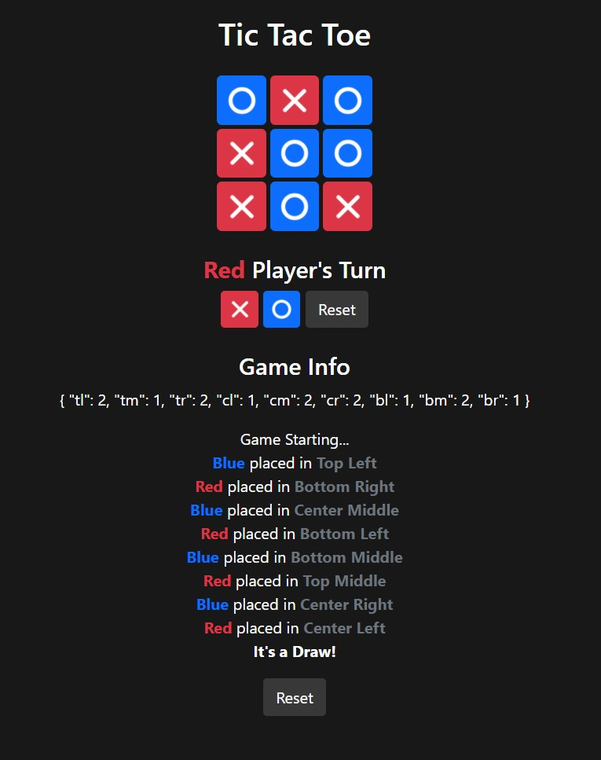

## Tic Tac Toe using Vue JS
The game I made has  9 buttons where each has a **dynamic class and attributes**, using Vue JS, to control the colors and the shapes of played. It **logs the moves** of each player under the "Game Info".

<p>
  
  
</p>

To run the program:
1. Download / Clone the project.
2. Open terminal and ```cd``` into the TicTacToe folder.
3. Run ```npm run serve``` in the terminal.
4. Go to the link shown in the terminal.
5. Have fun!